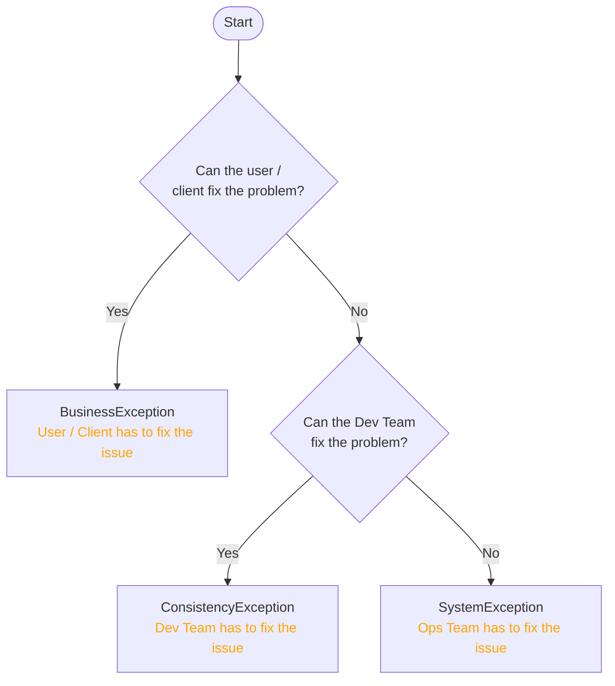

# 3 Types Of Exception

```mermaid
flowchart TD
    A([Start]) --> B{Can the user /\n client fix the problem?}
    B -- Yes --> C[BusinessException<br><span style="color:orange">User / Client has to fix the issue</span>]
    B -- No --> D{Can the Dev Team\n fix the problem?}
    D -- Yes --> E[ConsistencyException<br><span style="color:orange">Dev Team has to fix the issue</span>]
    D -- No --> F[SystemException<br><span style="color:orange">Ops Team has to fix the issue</span>]

```